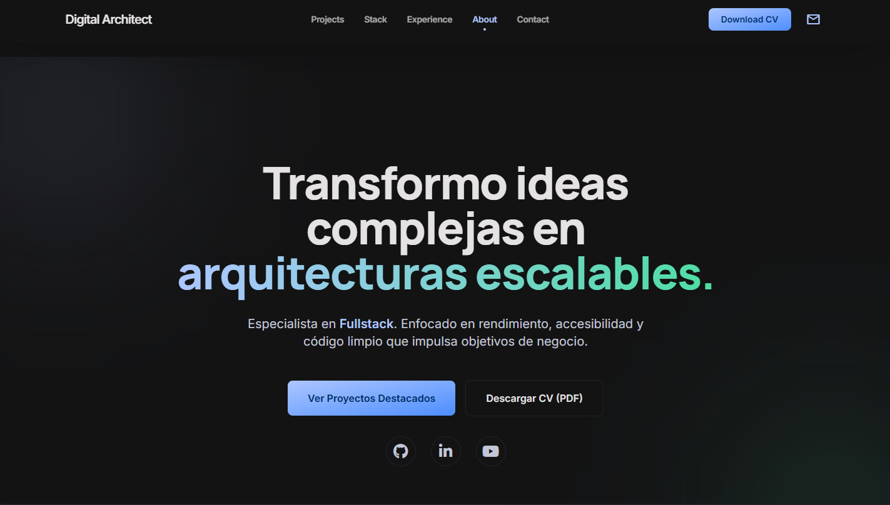

<h1 align="center"> 🌐 Portafolio – David Mondaca</h1>

<p align="center">
  
</p>

Bienvenido a mi portafolio web. Este proyecto reúne mis trabajos, habilidades y proyectos desarrollados durante mi aprendizaje en desarrollo web, con un enfoque en diseño limpio, responsive y buenas prácticas.

## 🧑‍💻 Sobre mí
Soy un desarrollador web apasionado por crear experiencias digitales innovadoras y responsivas. Me especializo en el desarrollo frontend con tecnologías modernas y siempre busco mejorar mis habilidades técnicas.

## 🎯 Objetivo del proyecto
Crear una landing page moderna que funcione como presentación personal, mostrando:
- Información sobre mí
- Mis habilidades
- Mis proyectos
- Medios de contacto

Este proyecto es también una práctica de:
- Maquetación web responsiva
- Estructura Mobile First
- Uso de Git para control de versiones
- Publicación con GitHub Pages

## 🚀 Tecnologías utilizadas
- **HTML5**
- **CSS3**
- **JavaScript**
- **Bootstrap**
- **Node.js**
- **Express.js**
- **Handlebars**
- **PosgreSQL**
- **Git & GitHub**

## 🛠️ Funcionalidades principales
- **Responsive Design**: El portafolio se adapta a diferentes tamaños de pantalla.
- **Interactividad**: Funcionalidades dinámicas implementadas con JavaScript.
- **Gestión de Contenido**: Uso de Handlebars para la generación de contenido.

## 🔗 Demo en línea
Puedes ver el sitio aquí:

👉 **https://portafolio-david-mondaca.vercel.app/**

## 📸 Vista previa


## 📂 Cómo clonar este repositorio
Si deseas revisar el código o modificarlo:

```bash
git clone https://github.com/David-HxH/portafolio-example.git
```
```bash
cd portafolio-example
```
```bash
pnpm install
```
```bash
pnpm start
```

## 📬 Contacto
Si deseas contactarme, puedes hacerlo a través de:
- **Email:** [David Mondaca](mailto:David_ems@live.cl)
- **LinkedIn:** [David Mondaca](https://www.linkedin.com/in/davidmondacasaavedra/)
- **instagram:** [@david_mondaca](https://www.instagram.com/david_ems.88/)
